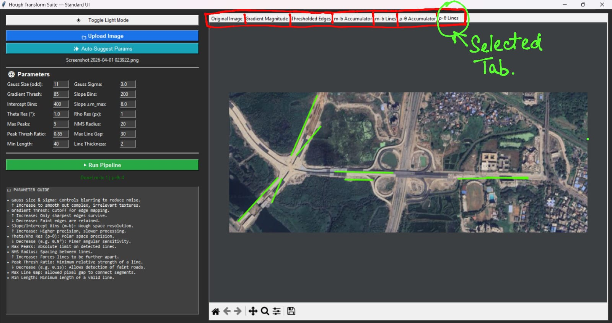

## Project submission for GNR630 by: Shresth Keshari(23b2243) and K.HimaVarsha (23b2226)

Code Explanation & Pipeline
- The pipeline is structured into primitive mathematical operations to ensure full control over the arrays and accumulators.

1. Preprocessing & Gradients (Sections 0–2)Custom Convolution: A pure NumPy convolve2d function is used alongside a custom-generated Gaussian kernel to smooth out image noise.Sobel Operators: Horizontal and vertical gradients ($G_x$, $G_y$) are computed manually to find edge magnitudes.Thresholding: Converts the continuous gradient magnitudes into a strict binary edge map.

2. The Hough Transforms (Sections 3a & 3b)The suite calculates accumulator arrays for two different parameter spaces:Slope-Intercept (m-b): Iterates through possible slopes and intercepts. (Limited by a maximum slope parameter m_max to prevent near-vertical asymptote issues).Polar (ρ-θ): The standard approach, calculating the perpendicular distance from the origin (ρ) for angles 0 to 180 degrees (θ).

3. Finite Line Rendering LogicInstead of drawing lines that start and end at the extreme edges of the image, this tool implements custom grouping logic to draw realistic, finite line segments (crucial for accurate road tracking).For both transforms, the code:Validates edge pixels that fall within a strict tolerance distance of the mathematical line.Sorts these pixels along the direction of the line.Checks the distance between adjacent pixels. If the gap exceeds the max_gap parameter, the line is "broken" into separate segments.Only draws segments that meet the min_length threshold, effectively filtering out noise and keeping distinct road networks isolated.

4. Peak Extraction (Section 4)A custom 2D Non-Maximum Suppression (NMS) algorithm. It finds the highest peak in the accumulator, records it, and zeroes out a surrounding neighborhood (nhood) to prevent clustering multiple identical lines on the exact same road edge.

5. Texture-Aware Auto-Suggest (Section 5)A smart parameter initialization feature. By calculating the local variance of the grayscale image, the system guesses if the uploaded image is a highly textured satellite shot (where variance is huge due to buildings, trees, and roads) or a simple, clean test image.If satellite imagery is detected, it automatically cranks up the blur, increases the allowable peaks (up to 150), and lowers the threshold ratio to pick up weaker, tiny colony roads.

6. Graphical Interface (Section 7)Built entirely in CustomTkinter and matplotlib backend integrations, providing an intuitive dark-mode interface to adjust parameters dynamically, render accumulator heatmaps, and visualize the final superimposed segments.

# 🛰️ Satellite Image Analysis: Hough Transform Suite

This repository contains a standalone desktop application for extracting linear structural features (like road networks and building footprints) from satellite imagery. It is a pure-NumPy implementation of the Hough Transform, calculating and visualizing both slope-intercept ($m-b$) and polar ($\rho-\theta$) parameter spaces.

## 🛠️ Dependencies & Installation

If you are running the application from the Python source code, ensure you have Python 3.11 or 3.12 installed. Install the required dependencies using `pip`:

`pip install opencv-python numpy matplotlib`

*(Note: `tkinter` is used for the GUI and is included in the standard Python library).*

### Launching the Executable (`.exe`)
If you have downloaded the packaged `.exe` file from the `dist/` folder, **no installation or Python environment is required.**
1. Navigate to the folder containing the `.exe` file.
2. Double-click the file to launch the application. 
3. *Note: A terminal window will not appear, and the GUI may take 3-5 seconds to initialize on the first launch.*

## 🚀 How to Use
1. Click **📁 Upload Image** and select an image.
2. *(Optional but recommended)* Click **✨ Auto-Suggest Params**. The app analyzes the image's variance to determine if it is a highly-textured satellite image and adjusts parameters automatically.
3. Click **▶ Run Pipeline**.
4. Use the tabs to inspect the gradient magnitude, binary edges, accumulator heatmaps, and the final isolated overlay lines.

## 📖 Parameter Guidelines
* **Gauss Size & Sigma:** Controls initial smoothing. Increase these for noisy images to prevent the edge detector from picking up useless texture.
* **Gradient Thresh:** The cutoff for the Sobel edge map. Decrease this to capture faint, low-contrast dirt roads.
* **Slope Bins / Intercept Bins (m-b):** Defines the resolution of the $m-b$ accumulator array.
* **Theta Res / Rho Res ($\rho-\theta$):** Defines the resolution of the polar accumulator. Lower Theta (e.g., `0.5°`) yields finer angular sensitivity.
* **Max Peaks:** The absolute maximum number of lines the algorithm is allowed to draw.
* **Peak Thresh Ratio:** The relative strength required to be considered a valid line (e.g., `0.15` means a line must have 15% of the votes of the absolute strongest line in the image).
* **Max Line Gap / Min Length:** Used when projecting infinite Hough lines back onto finite image segments. Connects broken line segments if they are close, and drops them if they are too short.

---

## 📸 Reference Template: Tested Configurations (original image: imgs/hough_1.png)

*Use this reference chart to find optimal starting parameters based on the type of satellite imagery you are analyzing.*

| Sample Image | Optimal Parameters |
| :--- | :--- |
|  | **Gauss Size:** `11` **Sigma:** `3.0` **Grad Thresh:** `85` (Strict) **Max Peaks:** `5` **Peak Ratio:** `0.85`  **Max Line Gap:** `30`  **Min Length:** `40`|

